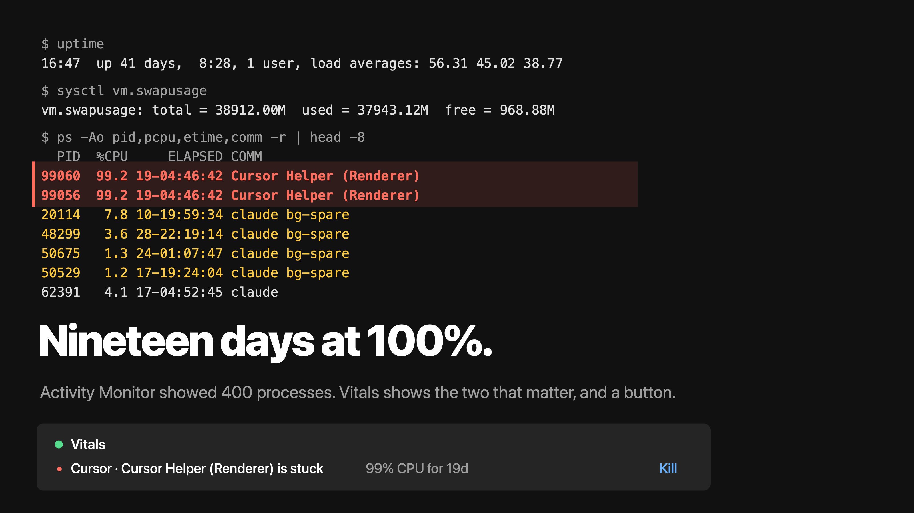
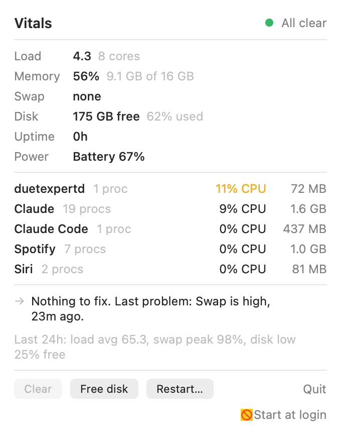
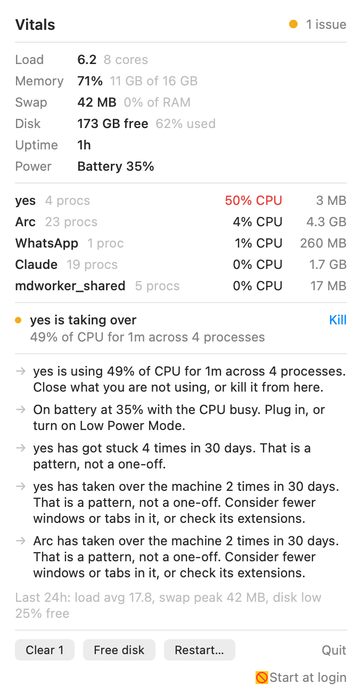
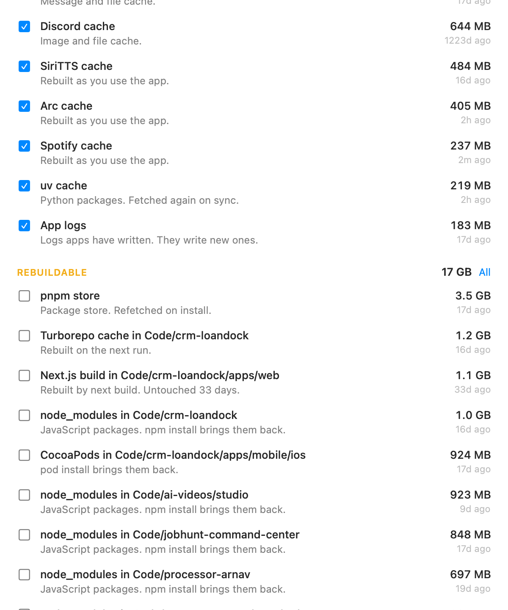

<p align="center">
  
</p>

<p align="center">
  <a href="https://github.com/dhruvsekhawat/vitals/releases/latest"></a>
  <a href="https://github.com/dhruvsekhawat/vitals/actions/workflows/ci.yml"></a>
  
  
  
  
  <a href="LICENSE"></a>
</p>

<h3 align="center">One line. No Xcode. Runs in the menu bar, stays out of the way.</h3>

```sh
curl -fsSL https://raw.githubusercontent.com/dhruvsekhawat/vitals/main/install.sh | sh
```

<p align="center"><sub>Or grab <a href="https://github.com/dhruvsekhawat/vitals/releases/latest">the latest release</a>, unzip, double-click. It is signed and notarized, so macOS just opens it.</sub></p>

<br>

<table align="center">
  <tr>
    <td align="center"><br><sub><b>A calm afternoon.</b> Green dot, nothing to do.</sub></td>
    <td align="center"><br><sub><b>Something is on fire.</b> Four cores pinned on purpose with <code>yes</code>. Named, measured, one button away from fixed.</sub></td>
  </tr>
</table>

<br>

## The story

My laptop was hot, the fans were loud, and it had felt slow for weeks. Activity Monitor showed 400 processes and no answer.

The real causes: two Cursor renderer processes pinned at 100% CPU **for nineteen days**, forty Claude Code helper processes leaked by sessions that had long since closed, swap packed solid, and no restart in forty-one days.

None of that is hard to find if you know which four commands to run. Vitals runs them for you, every few seconds, and only speaks up when something is actually wrong. Then it fixes it.

## What you get

<table>
  <tr>
    <td width="33%" valign="top">
      <h4>A dot that means something</h4>
      Green, yellow, or red in the menu bar, with a count. Click it and the whole picture is one panel: load, memory pressure, swap, disk, uptime, power, thermal state.
    </td>
    <td width="33%" valign="top">
      <h4>Apps, not processes</h4>
      Cursor is Cursor plus its 40 helpers, summed. Chrome is Chrome plus every tab. CPU is shown as a share of the whole machine, so 25% means a quarter of all your cores.
    </td>
    <td width="33%" valign="top">
      <h4>Plain language</h4>
      "Cursor Helper (Renderer) is stuck. 98% CPU for 19 days. It will not recover on its own. Kill it." Not a graph you have to interpret.
    </td>
  </tr>
  <tr>
    <td valign="top">
      <h4>One click</h4>
      Kill a stuck process. Quit an app politely so it saves its state. Clear every leaked helper at once. Restart. Each is one button, and each says what it will do.
    </td>
    <td valign="top">
      <h4>It comes to you</h4>
      A notification names the culprit the moment a problem crosses the line, with a Clear action right on the banner. Rate limited, and escalations get through.
    </td>
    <td valign="top">
      <h4>It remembers</h4>
      Thirty days of history. When the same renderer hangs for the fourth time this month, Vitals says so, and says why that usually happens.
    </td>
  </tr>
</table>

## What it catches

| | Verdict | What Vitals does about it |
| --- | --- | --- |
| A process pinned at high CPU for minutes | **is stuck** | offers Kill. SIGTERM first, SIGKILL only if ignored |
| A compiler or encoder pinned at high CPU | **is working hard** | tells you it is normal. No kill button |
| An app holding a big share of CPU for two minutes | **is taking over** | offers Quit, the polite kind. Never force-kills on its own |
| An app holding a big share of RAM while memory is under pressure | **is holding N GB** | says which app and tells you to close tabs or windows. No Quit: quitting the app you work in is not a fix |
| Helper processes whose parent session is gone | **leaked** | offers Clear for all of them at once |
| Memory pressure, from the same kernel signal Activity Monitor uses | **high / critical** | names the biggest app |
| Swap growing relative to RAM | **growing / heavy** | tells you only a restart empties it |
| Disk under 15% free | **low** | points you at the Storage window |
| Weeks without a restart | **worth a reboot** | offers Restart with the normal macOS confirmation |
| Thermal pressure | **getting warm / hot** | names the app most responsible |

## Storage

Disks fill up with things nobody chose to keep. Click **Storage** in the panel and Vitals finds them and grades them.

<p align="center"></p>

- **Safe to clear.** Comes back on its own: Xcode build products and device symbols, Homebrew, npm, pnpm, uv, pip, Cargo and Gradle caches, browser and app caches, the Adobe media cache, logs, installers for apps you already have. Selected by default.
- **Rebuildable.** Comes back with a reinstall or rebuild: `node_modules`, virtualenvs, Rust and Next.js output, CocoaPods, iOS simulators, Docker's disk image. Each project row says how long the project has been untouched.
- **Your files, review first.** Large files in Downloads, Desktop, Documents, Movies, old archives, iPhone backups. Listed with sizes so you can decide. Never selected for you.

One button moves the selection to the Trash. Nothing is deleted outright; the Trash is the undo. A second, separate button empties it, through Finder, after a confirmation.

## Why it is fast

Vitals is native Swift and nothing else. No web view, no Electron, no dependency outside the macOS SDK. It idles at **0% CPU** and about **70 MB** of memory, and a full sample of 400 processes takes a few milliseconds on a background queue. The panel never waits on the sampler.

It samples every 5 seconds, every 2 while the panel is open, every 15 on battery.

## How it works

Sampling reads load averages, `host_statistics64` for memory, the kernel's memory-pressure level, `vm.swapusage`, the root volume's real free space, `kern.boottime` for uptime, `ProcessInfo` for thermal state, and IOKit for the battery. Processes come from libproc: the pid list, start time, parent, owner, CPU time, and physical footprint. Command lines are read only for processes reparented to launchd, held in memory for rule matching, and never written anywhere.

Per-process CPU is the difference in CPU time between two samples over wall time, so it is a live number, not the lifetime average `ps` prints.

Two things about that were wrong in early builds, and both fail silently. `proc_listallpids` returns a count of pids, not a byte count. And `proc_taskinfo` reports CPU time in Mach ticks, which on Apple silicon are 125/3 nanoseconds each, not nanoseconds. There are integration tests for both now, which spin a real process at 100% and check that Vitals sees it.

Rules are pure functions of a sample, plus a little state for "how long has this been true" that resets when the machine wakes from sleep. A verdict needs three consecutive quiet samples to clear, so nothing flaps while the panel is open. History keeps incidents keyed by what they are, not by which pids they involve, so a leak that grows from six processes to nine is one incident, and a renderer that hangs under a new pid every day is counted as the pattern it is.

Remedies are the only code that changes anything. They only ever touch processes owned by you. Quitting an app asks it to terminate normally and stops there; if it declines, the panel says so and offers an explicit Kill. Freeing disk empties a fixed list of self-rebuilding caches and runs `pnpm store prune` and `brew cleanup` if you have them. Everything destructive is logged under `com.dhruv.vitals`.

The app installs a user LaunchAgent with KeepAlive on crash. Quit exits cleanly and stays quit until your next login.

## Check it from a shell

```sh
~/Applications/Vitals.app/Contents/MacOS/Vitals --snapshot panel.png
```

Renders the panel to a PNG and prints the per-app rollup to stderr, then exits. This is how the screenshots above were made, and how the UI is verified in CI. Works over SSH, needs no screen-recording permission.

```sh
log stream --predicate 'subsystem == "com.dhruv.vitals"' --level info
```

## Configure

Thresholds live in user defaults. Restart Vitals after changing one.

```sh
defaults write com.dhruv.vitals threshold.hotCPU 90
```

| Key | Default | Meaning |
| --- | --- | --- |
| `threshold.hotCPU` | 85 | percent of one core that counts as hot for a process |
| `threshold.hotFor` | 180 | seconds a process must stay hot to be reported |
| `threshold.appHogCPUShareWarn` | 35 | percent of the whole machine an app may hold before a warning |
| `threshold.appHogCPUShareBad` | 60 | percent of the whole machine that is marked bad |
| `threshold.appHogFor` | 120 | seconds an app must hold that share to be reported |
| `threshold.appHogMemShare` | 30 | percent of physical RAM an app may hold before it is reported |
| `threshold.swapWarn` | 25 | swap in use as a percent of physical RAM that triggers a warning |
| `threshold.swapBad` | 50 | swap in use as a percent of physical RAM that is marked bad |
| `threshold.diskWarnFreePct` | 15 | free disk percent below which a warning is raised |
| `threshold.diskBadFreePct` | 8 | free disk percent below which the disk is marked bad |
| `threshold.uptimeWarnDays` | 14 | days without a restart that trigger a warning |
| `threshold.uptimeBadDays` | 30 | days without a restart that are marked bad |
| `threshold.lifetimeHotCPU` | 75 | lifetime average CPU that flags a long-running process at once |
| `threshold.lifetimeMinAge` | 1800 | seconds a process must have run for the lifetime rule to apply |
| `threshold.bootGrace` | 600 | seconds after boot during which system indexers are left alone |
| `threshold.coolSamples` | 3 | consecutive quiet samples before a "stuck" or "hog" clock resets |

Swap is measured against RAM on purpose. macOS grows its swap files on demand, so "percent of swap used" sits near 100% whenever any swap exists and tells you nothing. Four gigabytes swapped on a 16 GB machine is worth a warning; eight is a machine that is paging constantly.

## Build from source

Needs macOS 14 and Xcode 15 or later.

```sh
git clone https://github.com/dhruvsekhawat/vitals.git
cd vitals
./build.sh
```

That builds a release binary, assembles `Vitals.app`, signs it, installs it to `~/Applications`, registers the LaunchAgent, and launches it. `./build.sh --test` runs the tests first. `UNIVERSAL=1 ./build.sh` builds for both architectures. `CODESIGN_IDENTITY` and `NOTARY_PROFILE` make it a notarized build; see [CONTRIBUTING.md](CONTRIBUTING.md).

## Privacy

Everything stays on the machine. Command lines are read into memory for rule matching and are never persisted or logged. The only files Vitals writes outside its own bundle are `~/Library/Application Support/Vitals/state.json`, which holds incidents and snapshots, and its LaunchAgent plist. Nothing is sent anywhere. There is no analytics, no update check, no network access at all.

## Uninstall

```sh
curl -fsSL https://raw.githubusercontent.com/dhruvsekhawat/vitals/main/install.sh | sh -s -- --uninstall
```

Or by hand:

```sh
launchctl bootout gui/$(id -u)/com.dhruv.vitals
rm ~/Library/LaunchAgents/com.dhruv.vitals.plist
rm -rf ~/Applications/Vitals.app
rm -rf ~/Library/Application\ Support/Vitals
```

## Contributing

See [CONTRIBUTING.md](CONTRIBUTING.md). The short version: keep it native, keep it small, and every rule gets a test. Bugs go in [issues](https://github.com/dhruvsekhawat/vitals/issues); anything that could make Vitals kill or delete the wrong thing goes through [private reporting](https://github.com/dhruvsekhawat/vitals/security/advisories/new).

## License

MIT. See [LICENSE](LICENSE).
